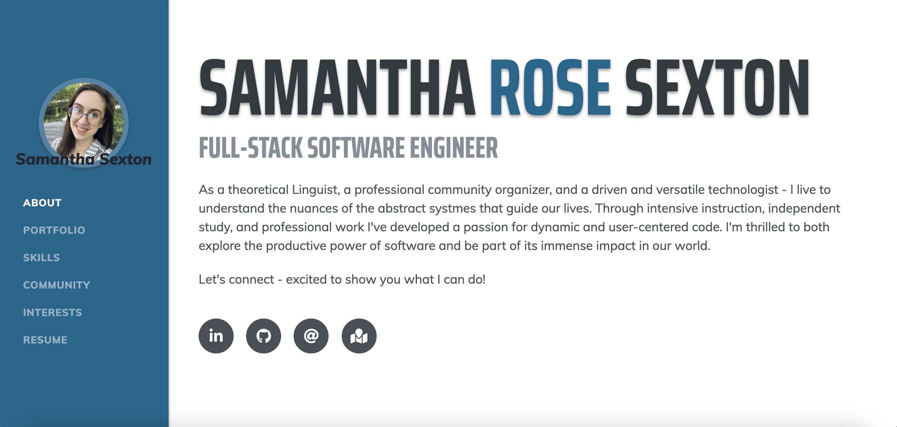
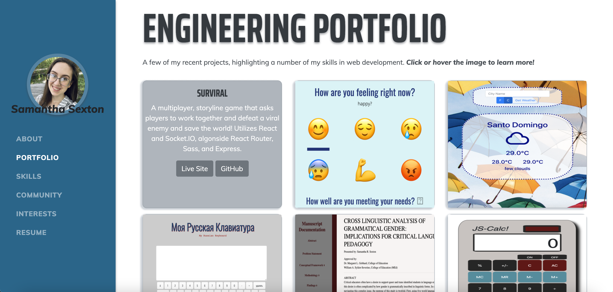
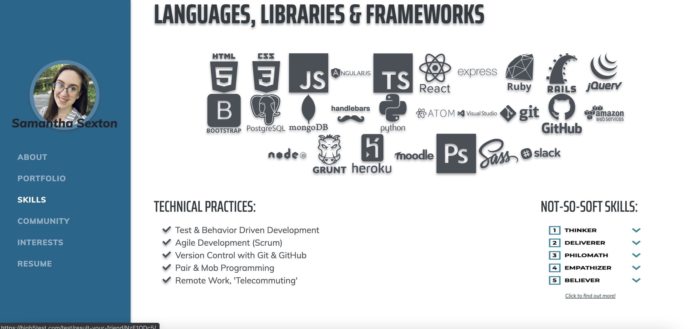
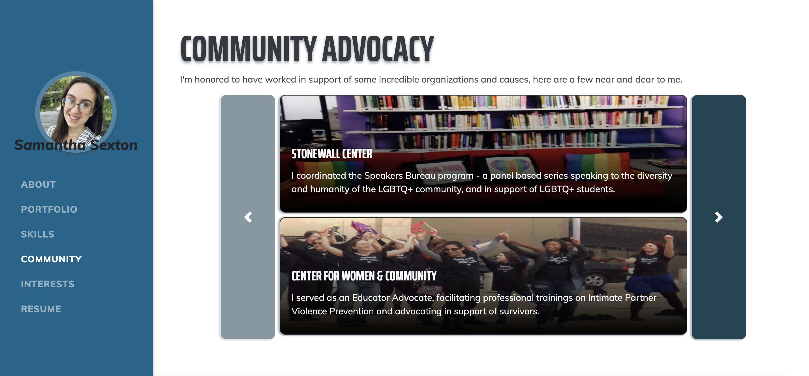
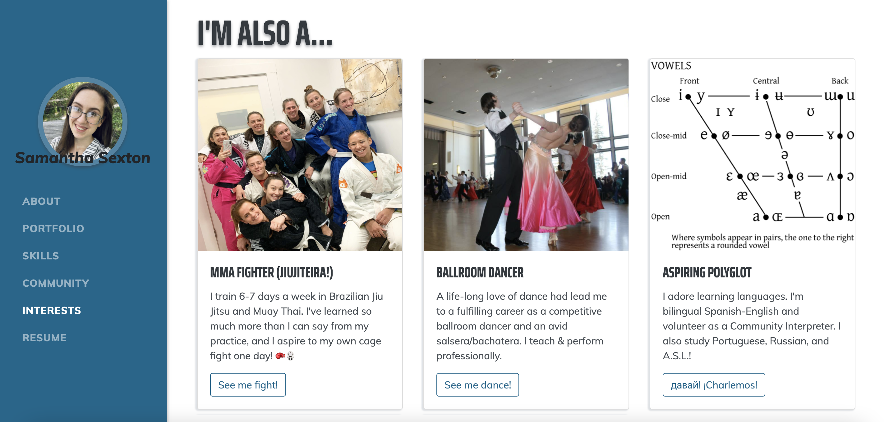
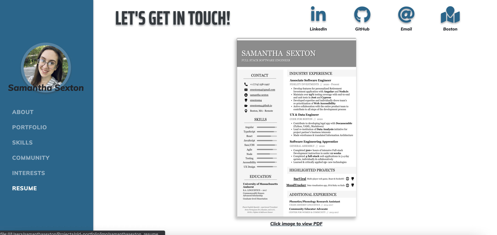

# Samantha R. Sexton - Full Stack Web Developer Portfolio
This is the repo for my personal site - detailing my work and experience as a
full stack developer.

*UPDATE:* I have recently decided to redesign my portfolio to better reflect new skills/interests/objectives, and as such this project is no longer hosted live. To view it you may pull the project & `open index.html`. 

### The repo for my updated portfolio is [here: srsexton94.github.io](https://github.com/srsexton94/srsexton94.github.io)

## Screenshots:

## To Include:
* About Me
* Skills
* Contact Info (linkedin, github, city, email)
* Resume (view and download)
* Project Showcase
* Optionally...
  - personal hobbies/Interests
  - professional timeline
  - additional work

### Dependencies
* [Resume theme](https://startbootstrap.com/template-overviews/resume/)
* [Bootstrap](http://getbootstrap.com/)
* `npm install` and `npm start`
- `gulp` the default task that builds everything
- `gulp watch` browserSync opens the project in your default browser and live reloads when changes are made
- `gulp css` compiles SCSS files into CSS and minifies the compiled CSS
- `gulp js` minifies the themes JS file
- `gulp vendor` copies dependencies from node_modules to the vendor directory

### User Stories
* As a non-technical HR manager, I want to quickly evaluate whether this candidate has the skills and experience to fill an open position at my company.
* As a mid-level engineer, I want to evaluate a junior developer’s coding skills by reviewing their projects and reading their code.
* As a friend of the person who built this portfolio, I want to understand what they do as a developer and what they have created.
